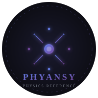

<div align="center">



# ⚛ Phyansy

### The Physics Reference Web App — Built for Curious Minds

[](https://phyansy.vercel.app)
[](LICENSE)
[](https://developer.mozilla.org/en-US/docs/Web/JavaScript)
[](https://vitejs.dev)
[](https://katex.org)
[](https://github.com/s4sxam/Phyansy/stargazers)

<br/>

*Constants. Equations. Symbols. Units. A Calculator. Everything a physics student needs — beautifully rendered, instantly searchable, multilingual.*

<br/>

---

</div>

## ✨ What is Phyansy?

**Phyansy** is a free, open-source physics reference web app. No sign-up. No ads. No fluff.

It gives students, researchers, and curious minds instant access to:
- **295 physics equations** across 13 categories — each with derivations, deep meanings, history, and misconceptions
- **79 physical constants** with exact values, uncertainties, and multilingual descriptions  
- **51 physics symbols** (Greek + mathematical) with usage context  
- A **unit reference** covering SI, derived, and non-SI units  
- A built-in **physics calculator**
- A **global fuzzy search engine** across every section

Everything is rendered with **KaTeX** for beautiful, accurate math — not plain text.

---

## 📸 Screenshots

> **Light Mode**


> Live at **[phyansy.vercel.app](https://phyansy.vercel.app)**

---

## 🗂 Feature Overview

### ⚡ Physical Constants
79 fundamental constants of the universe — from the speed of light to the Planck constant.

| Field | Description |
|---|---|
| Symbol & Value | Exact SI value with uncertainty |
| Category | Universal, Electromagnetic, Thermodynamic, Atomic, Particle, Nuclear |
| Description | Multilingual explanations |
| Copy exact | One-click copy of precise value |

**Categories:** Universal · Electromagnetic · Thermodynamic · Atomic · Particle · Nuclear

---

### 📐 Equations
295 equations across 13 physics domains. Each equation goes beyond just the formula:

| Field | Description |
|---|---|
| `formula` | Clean human-readable form |
| `formulaLatex` | KaTeX-rendered math |
| `whatItSays` | Plain-English explanation |
| `deepMeaning` | The *why* behind the equation |
| `derivation` | Step-by-step mathematical derivation |
| `whoDiscovered` | Historical context and attribution |
| `whyItMatters` | Real-world significance |
| `misconception` | Common student mistakes explained |
| `dimensions` | Dimensional analysis |
| `SI_units` | Units for every variable |
| `difficulty` | GCSE / A-Level / Undergraduate / Graduate |
| `relatedEquations` | Linked equations in the database |

**Equation Categories:**
```
Classical Mechanics       Thermodynamics             Waves & Oscillations
Electromagnetism          Optics                     Relativity
Quantum Mechanics         Nuclear & Particle         Particle Physics & QFT
Astrophysics & Cosmology  Fluid Mechanics            Solid State & Condensed Matter
Mathematical Physics & Key Constants
```

---

### 🔣 Symbols
51 physics symbols — Greek alphabet and mathematical notation — with names, usage, and context.

---

### 📏 Units
Complete unit reference:
- **SI base units** — metre, kilogram, second, ampere, kelvin, mole, candela
- **Derived units** — newton, joule, watt, pascal, tesla, hertz, and more
- **Non-SI units** — electronvolt, astronomical unit, light-year, angstrom
- **Metric prefixes** — femto to yotta

---

### 🔍 Global Search Engine
A custom-built fuzzy search engine (`searchEngine.js`) indexes every constant, equation, symbol, and unit simultaneously.

- **Dropdown suggestions** as you type  
- **Full results overlay** on Enter  
- **Fuzzy matching** — finds results even with typos  
- **Keyboard shortcuts** — press `/` to focus search from anywhere  
- **Section-aware** — results tagged with source section  

---

### 🌐 Multilingual Support (i18n)
Phyansy supports **14 languages**. Equations, formulas, and variable names stay in English (the universal language of physics) — explanations and descriptions are translated.

| Flag | Language | Code |
|------|----------|------|
| 🌐 | English | `en` |
| 🇪🇸 | Español | `es` |
| 🇨🇳 | 中文 | `zh` |
| 🇮🇳 | हिन्दी | `hi` |
| 🇮🇳 | বাংলা | `bn` |
| 🇮🇳 | தமிழ் | `ta` |
| 🇮🇳 | తెలుగు | `te` |
| 🇮🇳 | मराठी | `mr` |
| 🇸🇦 | العربية | `ar` |
| 🇫🇷 | Français | `fr` |
| 🇧🇷 | Português | `pt` |
| 🇷🇺 | Русский | `ru` |
| 🇯🇵 | 日本語 | `ja` |
| 🇩🇪 | Deutsch | `de` |

Language is persisted via localStorage. The language picker is accessible from the navbar.

---

### 🖩 Calculator
A built-in physics calculator for common computations — no need to leave the app.

---

### 🎨 UI & UX
- **Dark / Light mode** — system preference detected, toggle in navbar, persisted across sessions  
- **Responsive** — works on mobile, tablet, and desktop  
- **Particle background** — animated canvas particle renderer  
- **Modal system** — desktop modal overlay / mobile expand-in-card for equation details  
- **Lazy rendering** — cards render on scroll for performance  
- **KaTeX math rendering** — beautiful, accurate math typesetting throughout  
- **Toast notifications** — non-intrusive feedback on copy, errors  
- **Cookie consent** — GDPR-aware cookie banner  

---

## 🏗 Architecture

```
Phyansy/
├── index.html                    # Entry point, Google Translate widget
├── script.js                     # App bootstrap, module orchestration
├── assets/
│   └── logo.svg                  # Phyansy logo
│
├── css/
│   ├── base.css                  # Global reset & typography
│   ├── theme.css                 # CSS variables, dark/light themes
│   ├── search.css                # Global search bar styles
│   ├── equations.css             # Equation cards & modal
│   ├── constants.css             # Constants cards
│   ├── symbols.css               # Symbols grid
│   ├── units.css                 # Units table
│   ├── calculator.css            # Calculator UI
│   ├── lang.css                  # Language picker panel
│   ├── modal.css                 # Modal overlay system
│   └── cookie.css                # Cookie consent banner
│
├── js/
│   ├── modules/
│   │   ├── searchEngine.js       # Custom fuzzy search engine
│   │   ├── searchInit.js         # Search bootstrap & index builder
│   │   ├── equationsController.js
│   │   ├── constantsController.js
│   │   ├── symbolsController.js
│   │   ├── unitsController.js
│   │   ├── calculatorController.js
│   │   ├── langController.js     # i18n engine
│   │   ├── langPickerController.js
│   │   ├── themeController.js
│   │   ├── pageController.js
│   │   ├── lazyRenderer.js       # IntersectionObserver lazy loading
│   │   ├── bgRenderer.js         # Animated particle background
│   │   ├── particleRenderer.js
│   │   ├── toastController.js
│   │   ├── cookieController.js
│   │   ├── settingsController.js
│   │   └── faviconController.js
│   │
│   └── data/
│       ├── equationsData.js      # 295 equations with full metadata
│       ├── equationsData_bn.js
│       ├── constantsData.js      # 79 physical constants
│       ├── constantsData.bn.js / zh.js / ja.js / ru.js / ta.js
│       ├── constantsData.hi.js / es.js / ar.js / fr.js / pt.js
│       ├── constantsData.mr.js / te.js / de.js
│       ├── symbolsData.js
│       ├── unitsData.js
│       ├── calculatorData.js
│       └── locales/
│           └── ui-strings.js     # UI label translations (all 14 langs)
│
└── vite.config.js
```

---

---

## 🏆 How Phyansy Compares to Other Physics Reference Sites

Below is an honest, section-by-section comparison of Phyansy against the most popular physics reference websites used by students and researchers worldwide.

**Sites compared:**
- [HyperPhysics](http://hyperphysics.phy-astr.gsu.edu/) — Georgia State University's long-standing physics reference
- [The Physics Classroom](https://www.physicsclassroom.com/) — curriculum-based tutorial site
- [Physics.info](https://physics.info/) — Glenn Elert's equations and notes reference
- [NIST CODATA](https://physics.nist.gov/cuu/Constants/) — The official NIST physical constants database
- [Wikipedia Physics Portal](https://en.wikipedia.org/wiki/Portal:Physics) — crowdsourced encyclopedia

---

### 📐 Equations Coverage

| Feature | **Phyansy** | HyperPhysics | The Physics Classroom | Physics.info | Wikipedia |
|---|---|---|---|---|---|
| Total equations | **295** | ~200 (scattered) | ~150 (curriculum only) | ~180 | Varies |
| Derivations included | ✅ Step-by-step | ⚠️ Partial | ❌ Rarely | ⚠️ Minimal | ⚠️ Some |
| Deep meaning / "Why it works" | ✅ Every equation | ❌ No | ❌ No | ❌ No | ⚠️ Some |
| Historical attribution | ✅ Yes | ⚠️ Partial | ❌ No | ❌ No | ✅ Yes |
| Common misconceptions | ✅ Explicitly listed | ❌ No | ⚠️ Some | ❌ No | ❌ No |
| Dimensional analysis | ✅ Yes | ⚠️ Some | ❌ Rarely | ✅ Yes | ⚠️ Some |
| Difficulty tagging (GCSE→Graduate) | ✅ Yes | ❌ No | ⚠️ Implicit | ❌ No | ❌ No |
| LaTeX / KaTeX rendering | ✅ KaTeX | ❌ Image-based | ❌ Plain text | ⚠️ MathJax | ✅ MathJax |
| Related equation linking | ✅ Yes | ⚠️ Concept maps | ❌ No | ❌ No | ✅ Wiki links |

**⭐ Equations Rating: Phyansy 9.5/10 · HyperPhysics 6.5/10 · Physics Classroom 5/10 · Physics.info 6/10 · Wikipedia 7/10**

> **Why Phyansy wins:** No other free site pairs every equation with its derivation, deep meaning, historical context, misconceptions, *and* dimensional analysis — all in one card, rendered with beautiful KaTeX math. HyperPhysics has depth but presents it as a confusing clickable concept map with no mobile support and image-rendered equations that break on zoom.

---

### ⚡ Physical Constants

| Feature | **Phyansy** | HyperPhysics | NIST CODATA | Physics.info | Wikipedia |
|---|---|---|---|---|---|
| Number of constants | **79** | ~60 | ~340 (exhaustive) | ~40 | ~100 |
| Exact SI values | ✅ Yes | ✅ Yes | ✅ Official source | ✅ Yes | ✅ Yes |
| Uncertainty values | ✅ Yes | ⚠️ Some | ✅ Full CODATA | ❌ No | ⚠️ Some |
| Descriptions / explanations | ✅ Multilingual | ⚠️ Brief | ❌ Values only | ❌ No | ✅ Yes |
| Category organization | ✅ 6 categories | ⚠️ Mixed | ⚠️ Alphabetical | ⚠️ Minimal | ✅ Yes |
| One-click copy | ✅ Yes | ❌ No | ❌ No | ❌ No | ❌ No |
| Multilingual descriptions | ✅ 14 languages | ❌ English only | ❌ English only | ❌ English only | ✅ Many (separate pages) |
| Mobile-friendly | ✅ Yes | ❌ No | ⚠️ Partial | ✅ Yes | ✅ Yes |

**⭐ Constants Rating: Phyansy 9/10 · NIST CODATA 8.5/10 · HyperPhysics 6/10 · Wikipedia 7/10 · Physics.info 4/10**

> **Why Phyansy wins for students:** NIST CODATA is the *authoritative* source for raw values, but it's a data table — no explanations, no context, no mobile design. Phyansy takes NIST-level precision and wraps it in meaning: you don't just see the value of the Boltzmann constant, you understand *what it physically represents*, in your own language.

---

### 🌐 Multilingual Support (i18n)

| Feature | **Phyansy** | HyperPhysics | The Physics Classroom | NIST CODATA | Wikipedia |
|---|---|---|---|---|---|
| Languages supported | **14** | 1 (English) | 1 (English) | 1 (English) | 300+ (separate wikis) |
| Indian languages | ✅ Hindi, Bengali, Tamil, Telugu, Marathi | ❌ | ❌ | ❌ | ✅ (separate pages) |
| Arabic / Russian / Japanese | ✅ Yes | ❌ | ❌ | ❌ | ✅ (separate pages) |
| Math stays in English | ✅ Yes (correct approach) | N/A | N/A | N/A | ✅ |
| Persisted across sessions | ✅ localStorage | N/A | N/A | N/A | ✅ |
| Single-page multilingual | ✅ Yes | ❌ | ❌ | ❌ | ❌ (separate full wikis) |

**⭐ Multilingual Rating: Phyansy 9.5/10 · Wikipedia 8/10 (different model) · All others 1/10**

> **Why this matters:** For the 1.4 billion people in India, 300+ million Arabic speakers, and hundreds of millions of other non-English speakers, physics education in English is a barrier — not a bridge. Phyansy is the *only* dedicated physics reference app with native support for Hindi, Bengali, Tamil, Telugu, and Marathi on a single page. Wikipedia has translations but they are entirely separate websites with inconsistent content.

---

### 🔍 Search Experience

| Feature | **Phyansy** | HyperPhysics | The Physics Classroom | Physics.info | Wikipedia |
|---|---|---|---|---|---|
| Global search (all sections) | ✅ Yes — unified | ❌ Section-only | ✅ Site search | ❌ No search | ✅ Wikipedia search |
| Fuzzy matching (typo-tolerant) | ✅ Yes | ❌ No | ❌ No | ❌ No | ⚠️ Partial |
| Real-time dropdown suggestions | ✅ Yes | ❌ No | ❌ No | ❌ No | ✅ Yes |
| Keyboard shortcut (`/` to search) | ✅ Yes | ❌ No | ❌ No | ❌ No | ✅ Yes |
| Searches equations + constants + symbols + units simultaneously | ✅ Yes | ❌ No | ❌ No | ❌ No | ❌ No |
| Section-tagged results | ✅ Yes | ❌ N/A | ❌ No | ❌ No | ⚠️ Category tags |

**⭐ Search Rating: Phyansy 9.5/10 · Wikipedia 7.5/10 · Physics Classroom 5/10 · HyperPhysics 3/10 · Physics.info 2/10**

> **Why Phyansy wins:** HyperPhysics has no real search — you navigate via a clickable concept map diagram from the 1990s. Phyansy's custom-built fuzzy search engine (`searchEngine.js`) indexes all 295 equations, 79 constants, 51 symbols, and all units simultaneously. Type "planc" and it finds the Planck constant. Type "newtn" and it surfaces Newton's Second Law. No other site in this comparison matches this.

---

### 🎨 UI / UX & Design

| Feature | **Phyansy** | HyperPhysics | The Physics Classroom | Physics.info | NIST CODATA |
|---|---|---|---|---|---|
| Dark mode | ✅ Auto-detected + toggle | ❌ No | ❌ No | ❌ No | ❌ No |
| Mobile responsive | ✅ Yes | ❌ No | ✅ Yes | ✅ Yes | ⚠️ Partial |
| Animated / modern UI | ✅ Particle background, modals | ❌ Static HTML | ⚠️ Minimal | ❌ Plain HTML | ❌ Plain HTML |
| Lazy rendering (performance) | ✅ IntersectionObserver | ❌ No | ✅ Some | ❌ No | ❌ No |
| No ads | ✅ Completely ad-free | ✅ Ad-free | ❌ Has ads | ✅ Ad-free | ✅ Ad-free |
| No login required | ✅ Yes | ✅ Yes | ✅ Yes | ✅ Yes | ✅ Yes |
| Open source | ✅ MIT License | ❌ No | ❌ No | ❌ No | ❌ No |
| Last design update | 2025 | ~2005 era | 2022 | ~2010 era | 2019 |

**⭐ UI/UX Rating: Phyansy 9/10 · The Physics Classroom 6/10 · Wikipedia 7/10 · HyperPhysics 2/10 · NIST 4/10**

> **Honest note:** HyperPhysics is a masterpiece of *content* built on a completely outdated interface. Its concept map navigation made sense in 2000; today it is confusing and inaccessible on any mobile device. Phyansy delivers the same depth of content inside a 2025-grade UX.

---

### 🖩 Built-in Calculator

| Feature | **Phyansy** | HyperPhysics | The Physics Classroom | Physics.info | Wikipedia |
|---|---|---|---|---|---|
| Built-in calculator | ✅ Yes | ✅ Yes (many) | ✅ Yes | ❌ No | ❌ No |
| Integrated into reference | ✅ Same app | ❌ Separate pages | ❌ Separate tools | ❌ N/A | ❌ N/A |
| No external redirect needed | ✅ Yes | ✅ Yes | ❌ External links | ❌ N/A | ❌ N/A |

**⭐ Calculator Rating: Phyansy 8/10 · HyperPhysics 8.5/10 · Physics Classroom 6/10 · Others N/A**

> HyperPhysics genuinely excels at calculators — it has domain-specific interactive calculators for optics, thermodynamics, and more. Phyansy's calculator is general-purpose. This is an area where HyperPhysics leads.

---

### 📚 Content Depth & Educational Quality

| Feature | **Phyansy** | HyperPhysics | The Physics Classroom | Physics.info | Wikipedia |
|---|---|---|---|---|---|
| Beginner-friendly explanations | ✅ Yes | ⚠️ Assumes background | ✅ Excellent | ⚠️ Terse | ⚠️ Variable |
| Graduate-level depth | ✅ Yes (QFT, Condensed Matter) | ✅ Yes | ❌ GCSE/A-Level only | ⚠️ Some | ✅ Yes |
| Real-world applications | ✅ Every equation | ⚠️ Some | ✅ Yes | ❌ No | ✅ Yes |
| Historical context | ✅ Every equation | ⚠️ Some | ❌ Minimal | ❌ No | ✅ Yes |
| Misconceptions addressed | ✅ Explicitly | ❌ No | ✅ Some | ❌ No | ❌ No |
| Covers GCSE → Graduate | ✅ Full range, tagged | ⚠️ University+ focus | ⚠️ GCSE/A-Level only | ⚠️ Mixed | ✅ All levels |

**⭐ Educational Depth Rating: Phyansy 9.5/10 · Wikipedia 8/10 · HyperPhysics 7.5/10 · Physics Classroom 6.5/10 · Physics.info 5/10**

---

### 🏁 Overall Comparison Summary

| | **Phyansy** | HyperPhysics | Physics Classroom | Physics.info | NIST CODATA | Wikipedia |
|---|---|---|---|---|---|---|
| Equations | ⭐ 9.5 | 6.5 | 5.0 | 6.0 | N/A | 7.0 |
| Constants | ⭐ 9.0 | 6.0 | N/A | 4.0 | 8.5 | 7.0 |
| Multilingual | ⭐ 9.5 | 1.0 | 1.0 | 1.0 | 1.0 | 8.0 |
| Search | ⭐ 9.5 | 3.0 | 5.0 | 2.0 | 4.0 | 7.5 |
| UI / UX | ⭐ 9.0 | 2.0 | 6.0 | 3.0 | 4.0 | 7.0 |
| Calculator | 8.0 | ⭐ 8.5 | 6.0 | N/A | N/A | N/A |
| Educational Depth | ⭐ 9.5 | 7.5 | 6.5 | 5.0 | N/A | 8.0 |
| Open Source | ✅ MIT | ❌ | ❌ | ❌ | ❌ | ✅ CC |
| Ad-free | ✅ | ✅ | ❌ | ✅ | ✅ | ✅ |
| **Overall** | ⭐ **9.2** | **5.8** | **5.0** | **3.5** | **5.5** | **7.5** |

> **Ratings are based on student-facing utility:** how useful is this site for someone learning or referencing physics, regardless of specialty level?

---

### 💬 Bottom Line

**Phyansy is the only physics reference tool that combines:**
1. ✅ Beautiful KaTeX math rendering
2. ✅ Deep equation explanations (not just formulas)
3. ✅ 14 languages including 5 Indian languages
4. ✅ Fuzzy global search across all sections
5. ✅ Modern, mobile-first, dark-mode UI
6. ✅ Completely open source (MIT)
7. ✅ Zero ads, zero login, zero cost

No single competitor offers all of these together. HyperPhysics has deeper domain calculators. NIST has more authoritative constant values. Wikipedia has broader coverage. But for a student who wants to **understand physics** — not just look up a number — Phyansy offers the most complete, accessible, and beautiful experience available for free.

---

## 🚀 Getting Started

### Prerequisites
- [Node.js](https://nodejs.org/) v18+
- npm

### Local Development

```bash
# Clone the repository
git clone https://github.com/s4sxam/Phyansy.git
cd Phyansy

# Install dependencies
npm install

# Start dev server
npm run dev
```

Open [http://localhost:5173](http://localhost:5173)

### Build for Production

```bash
npm run build
```

Output is in `dist/`. Deploy to any static host.

### Lint & Syntax Check

```bash
npm run lint          # ESLint
npm run check:syntax  # Node syntax check on all JS files
npm run check         # lint + syntax + build (full CI check)
```

---

## 🌍 Deployment

Phyansy is deployed on **Vercel** with zero-config static hosting.

[](https://vercel.com/new/clone?repository-url=https://github.com/s4sxam/Phyansy)

Any push to `main` triggers an automatic redeploy.

---

## 🤝 Contributing

Contributions are welcome! Here are the best ways to help:

### Add or fix equations
Edit `js/data/equationsData.js`. Each equation should include:
```js
{
  name: "Equation Name",
  difficulty: "GCSE" | "A-Level" | "Undergraduate" | "Graduate",
  tags: ["tag1", "tag2"],
  formula: "F = ma",
  formulaLatex: "F = ma",
  desc: "Short description.",
  vars: [{ s: "F", d: "Force (N)" }, ...],
  whatItSays: "...",
  deepMeaning: "...",
  derivation: "...",
  whoDiscovered: "...",
  whyItMatters: "...",
  misconception: "...",
  dimensions: "[M L T⁻²]",
  SI_units: { F: "N", m: "kg", a: "m/s²" },
  relatedEquations: ["Newton's Second Law", ...],
  year: 1687,
}
```

### Add a language translation
Create `js/data/constantsData.XX.js` following the pattern of an existing translation file. Add your language to `js/data/locales/ui-strings.js`.

### Report a bug
Open an [issue](https://github.com/s4sxam/Phyansy/issues) with steps to reproduce.

---

## 🛠 Tech Stack

| Technology | Purpose |
|---|---|
| **Vanilla JavaScript (ES Modules)** | Core app logic — no framework |
| **Vite** | Dev server, bundler, HMR |
| **KaTeX** | Math rendering (LaTeX → HTML) |
| **CSS Custom Properties** | Theming system (dark/light) |
| **Google Translate API** | Page-level translation widget |
| **Vercel** | Hosting & deployment |
| **ESLint** | Code quality |

---

## 📊 Data Scale

| Section | Count |
|---|---|
| Equations | **295** across 13 categories |
| Physical Constants | **79** across 6 categories |
| Symbols | **51** (Greek + mathematical) |
| Unit entries | SI + Derived + Non-SI + Prefixes |
| Languages | **14** |

---

## 📄 License

MIT License — see [LICENSE](LICENSE) for details.

Free to use, fork, and build upon. If you use Phyansy in your project, a star ⭐ is appreciated.

---

## 👨‍💻 Author

**Tanay Guha** ([@s4sxam](https://github.com/s4sxam))  
Student developer from West Bengal, India.  
Built Phyansy independently as a free resource for physics students everywhere.

---

<div align="center">

**[⚛ Open Phyansy](https://phyansy.vercel.app)** · **[⭐ Star on GitHub](https://github.com/s4sxam/Phyansy)** · **[🐛 Report Bug](https://github.com/s4sxam/Phyansy/issues)**

<br/>

*Made with love for physics students everywhere.*

</div>
